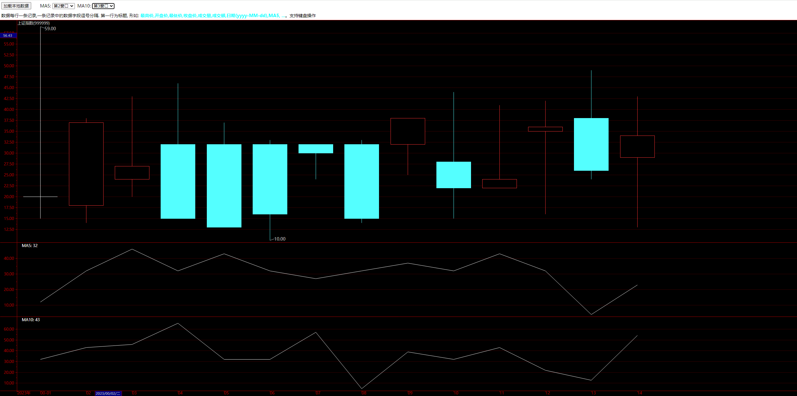

# 📉EtuKChart📈


这是一个专用于加载自定义数据，帮助大家进行K线图分析的工具。纯JS(typescript)写成。因此可以运行在所有最新浏览器中，无论手机，平板，电脑浏览器皆可用。
同时可以独立运行，不依赖后台代码服务。K线图展示需要的数据通过加载本地文件实现。
当然也可以通过各种行情平台服务AJAX请求获取数据。


## 1. 演示地址
[❤️点击跳转演示地址❤️](http://www.zsaltec.com/static/etukchart)

## 2. 使用

### 2.1. 途径一、直接访问演示地址

开启页面后, 点击加载本地数据按钮。加载后显示K线图。

### 2.2. 途径二、自己搭建Web服务

从release处下载app.js和index.html到本地文件夹。然后在此文件夹下启动一个Web静态文件服务。

如果安装有python3,可以使用以下命令启动文件服务:
```python
#首先进入放置app.js和index.html的文件夹
cd /path/to/your/folder
#启动文件服务
python -m http.server 8080
```
最后打开浏览器访问http://localhost:8080即可看到页面。


### 2.3. 自定义数据
由于是加载本地文本文件, 因此需要按照以下要求准备数据。
数据每行一条记录,一条记录中的数据字段逗号分隔. 第一行为标题, 形如: 
```
最高价,开盘价,最低价,收盘价,成交量,成交额,日期(yyyy-MM-dd),MA5, ...
```
前七个字段为固定字段,其中(最高价,开盘价,最低价,收盘价,日期)必须有值,不能空着。日期字段格式为 yyyy-MM-dd。后续字段为自定义字段, 可以根据需要自行添加。

### 3. 交流学习

QQ群: 494570178
